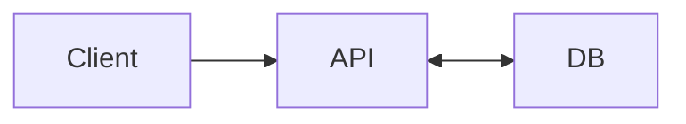
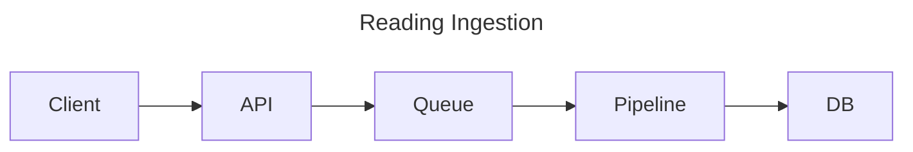

# Device Readings Project

- [Prompt](#prompt)
- [Evaluation Criteria](#evaluation-criteria)
- [Running the Project](#running-the-project)
  - [Docker Compose](#docker-compose)
  - [Development Environment](#development-environment)
- [Project Layout](#project-layout)
- [API Documentation](#api-documentation)
  - [Common status codes](#common-status-codes)
  - [Store Readings](#store-readings)
  - [Get Latest Reading](#get-latest-reading)
  - [Get Count of Readings](#get-count-of-readings)
- [System Design](#system-design)
  - [Functional Requirements](#functional-requirements)
  - [Non-Functional Requirements](#non-functional-requirements)
  - [Core Entities](#core-entities)
  - [API](#api)
  - [High Level Design](#high-level-design)
  - [Deep Dive Topics](#deep-dive-topics)
- [Reflection](#reflection)

## Prompt

~~Redacted.~~

## Evaluation Criteria

- [Instructions on build & start web API locally](#development-environment)
- [Documentation for API](#api-documentation)
- [A brief summary of the project structure](#project-layout)
- List of improvements, items, optimizations you would make if you had more time
  - [Deep dive topics](#deep-dive-topics)
  - [Reflection](#reflection)

## Running the Project

### Docker Compose

If you have [Docker Compose](https://docs.docker.com/compose/) installed, you can run the project with the following command:

```sh
make compose-up
```

### Development Environment

If you are comfortable with setting up the development environments, you can run the project on your local machine.

#### Setup

The development environment is managed with [asdf-vm](https://asdf-vm.com/). This isn't required, but it will ensure all the correct versions of the tools are installed.

```sh
make setup-dev-env
```

#### Run

```sh
make run
```

#### Test

```sh
make test
```

---

## Project Layout

This project utilizes the standard [Go project layout](https://github.com/golang-standards/project-layout).

- `cmd/` contains the API entrypoint
- `internal/` - [read](https://github.com/golang-standards/project-layout#internal)
- `internal/api/` contains the REST API implementation
- `internal/db/` contains the database implementation
- `internal/dsa/` - helper data structures
- `internal/repo/` - business rules and logic (to ensure consistency across DB implementations)

## API Documentation

Normally I create OpenAPI specs using swagger. Due to time constraints I will document the API inline. A [Postman collection](./docs/device-readings.postman_collection.json) is also available.

### Common status codes

| Code | Retryable | Description |
| --- | --- | --- |
| 200 | N/A | Success with response |
| 204 | N/A | Success without response |
| 400 | No | Invalid request, fix request data |
| 404 | No | Not found|
| 500 | Yes | Internal server error|

### Store Readings

Endpoint:

`POST /v1/devices/:id/readings`

Path Parameters:

- `:id` - Device UUID

Request:

```json
{
  "id": "device-uuid",
  "readings": [
    {
      "timestamp": "2006-01-02T15:04:05-07:00",
      "count": 2
    }
  ]
}
```

Response:

```json
{}
```

### Get Latest Reading

Endpoint:

`GET /v1/devices/:id/readings/latest`

Path Parameters:

- `:id` - Device UUID

Response:

```json
{
  "latest_timestamp": "2006-01-02T15:04:05-07:00"
}
```

### Get Count of Readings

Endpoint:

`GET /v1/devices/:id/readings/count`

Path Parameters:

- `:id` - Device UUID

Response:

```json
{
  "cumulative_count": 17
}
```

Undocumented endpoints:

- GET `/v1/devices/:id/readings` - list all readings for a device
- GET `/health` - container healthcheck

---

## System Design

### Functional Requirements

- store readings for devices
  - ignore duplicate readings (note: I do not increment the count for duplicate readings)
- get latest reading for a device
- get count of readings for a device

### Non-Functional Requirements

- limit project to 4 hours
- keep notes on incorporating external dependencies (databases, data pipelines)
- describe what you would do differently with more time
- no data can be persisted to disk and must be stored in memory
- use any language, framework or libraries

### Core Entities

Reading:

- timestamp
- count

Device:

- id

### API

A basic REST API with the following endpoints:

- POST `/v1/devices/:deviceId/readings` {readings: [{timestamp, count}]}
- GET `/v1/devices/:deviceId/readings/latest` -> {latest_timestamp}
- GET `/v1/devices/:deviceId/readings/count` -> {cumulative_count}

This is covered in the [API Documentation](#api-documentation).

### High Level Design

This is how I will approach the project:



### Deep Dive Topics

- Queue: add message queue between client and API (unreliable network, async processing, horizontal scaling).
- Database:
  - Timeseries database for timestamp & value data.
  - NoSQL if additional fields on readings are needed.
- Cache: frequently accessed data that might be expensive to compute/fetch (reading counts, latest reading).
- Data Platform: split data (devices, readings) into transactional and analytical databases.
- Data Pipeline: industry best practice for collecting, processing and storing data in an optimized read format.

#### Data Pipeline

If I had more time I would create a data pipeline for ingesting readings. This decouples collection, processing, storage and retrieval of readings.

Options:

- batch (ETL + DAG) would be a good fit since the payload is a batch; causes latency for consumers
- streaming could be an option if consumers need lower latency updates



## Reflection

Rationale for design decisions:

- I chose Golang for this project because it has been my primary language for the last few years. At Kenna Security, I worked with Sinatra, Ruby on Rails, and RSpec; I am familiar with the Ruby ecosystem.
- I initially considered using an in-memory SQLite database but assumed it was not in the spirit of the project.
- Readings appear to be timeseries data. I would normally use a timeseries database or NoSQL.
- I chose NOT to count duplicate readings in the "cumulative counts" data. If counts of all readings are needed, I have a placeholder map that can be used.
- I originally planned on saving the data into a simple map `{deviceId: [{reading}]}`. However I started noticing the sorting of readings by timestamp, the need to find the latest reading, and keeping a count would have a lot of synchronization issues. Therefore I started researching a different approach.
- While I am not a DSA expert, I know many databases use B-Trees for indexing. I was pleasantly surprised learn B-Tree's met the key requirements:
  - latest reading (record is at the root)
  - count of readings (size of the tree)
  - sorted readings by timestamp
- The instructions have a typo in the time format. Under "Storing Readings," `ISO-8061` should be [ISO-8601](https://en.wikipedia.org/wiki/ISO_8601).

If I had more time:

- My API documentation is not exhaustive! Some status codes are possibly missing. The response formats only document the happy path. I normally use Swagger which documents all codes + responses.
- I chose to ignore handling timezones for this project.
- In a real project I would create separate models for layers (eg: API, repository and database).
- A missing device doesn't always throw a `404` error (get devices & latest reading).
- I made a quick Postman collection, normally this can be generated from the OpenAPI spec.
- Add test fixtures to reduce duplicate "reading" data (DRY).
- Tests have duplicated code which should be refactored into test helpers.
- More test coverage of edge cases.
- There isn't any configuration. I usually use environment variables.
- I didn't verify API content type negotion works (Gin supports json & xml).
