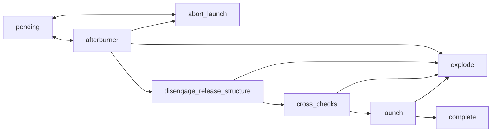

# Mission Control

A code exercise.

## Prerequisites

- Ruby (I use [asdf-vm](https://asdf-vm.com) for managing development dependencies)
- `bundle install`

## Running

```sh
rake game
# or
LOG_LEVEL=trace rake game # <- trace level logging
```

## Project Concerns

- Use a Text User Interface for the UI
- Converting between different units can be difficult if there isn't standardization

## Next Steps

- Add more unit tests!
- Ensure all game flow paths work

## Launch Overview


